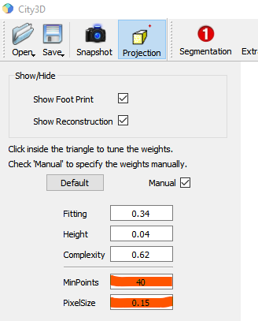

## Parameter Tuning

City3D involves several parameters that work for most already tested buildings. Adjustments to the following two 
parameters might be necessary for the practical reconstruction from datasets with varying characteristics:

- `min_points` (for plane/roof extraction).
   This parameter defines the minimum number of points required to detect roof planes, which affects the granularity of 
   plane extraction. A smaller value yields more planes capturing finer details and smaller structures but potentially 
   with less confidence. However, decreasing `min_points` may lead to an excessive number of candidate faces (and
   thus an optimization problem that may not be solved within a reasonable time window). In this case, the user is
  advised to increase `pixel_size` to target results with simpler structures.

- `pixel_size` (in height map generation). This parameter determines the resolution of the height map, which will 
   affect the precision of line detection for footprint generation. The recommended values are typically in the range
   [0.15, 0.3]. A smaller value increases the resolution of the height map and thus results in more detailed 
   reconstruction results. However, decreasing `pixel_size` may lead to an excessive number of candidate faces (and 
   thus an optimization problem that may not be solved within a reasonable time window). In this case, the user is 
   advised to increase `pixel_size` to target results with simpler structures.

[//]: # (#### 3. **Ground** &#40;Footprint Generation&#41;)
[//]: # (The **Ground** parameter defines the Z-value &#40;height&#41; of the footprint polygon, applicable only if no pre-existing footprint data is available.)
[//]: # ()
[//]: # (**Adjustment Guidelines**:)
[//]: # (- If you have access to the complete raw point cloud data, including both the roof and ground points, it would be advisable to directly inspect the data and set the ground height based on the actual ground points.)
[//]: # (- If no ground-level data is available, an alternative approach is to experiment with different values. You can start with value of 0.0 and adjust as needed.)

### Tuning in GUI Mode
For [City3D](https://github.com/tudelft3d/City3D/tree/main/code/City3D), these parameters can be 
adjusted interactively (see image below). You can check the `Manual` box to access these parameters.

 
      

### Tuning in Command Line Mode
For [CLI_Example_1](https://github.com/tudelft3d/City3D/tree/main/code/CLI_Example_1) and 
[CLI_Example_2](https://github.com/tudelft3d/City3D/tree/main/code/CLI_Example_2), these parameters can be manually 
tuned within the source code, e.g.,
https://github.com/tudelft3d/City3D/blob/210325f108b00fcf54d6f80853655e487a4e26af/code/CLI_Example_1/main.cpp#L31
https://github.com/tudelft3d/City3D/blob/210325f108b00fcf54d6f80853655e487a4e26af/code/CLI_Example_1/main.cpp#L32

