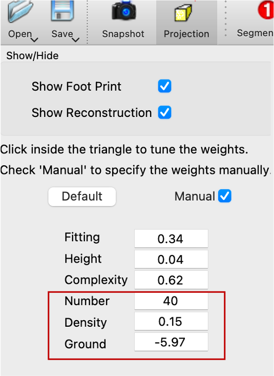

### Parameter Tuning 

For LoD2 building reconstruction on custom datasets, adjustments to specific parameters may be necessary. Three primary parameters—**Number**, **Density**, and **Ground**—are key to optimizing the reconstruction process for varying dataset characteristics.

#### 1. **Number** (Plane Detection)
This parameter defines the granularity of plane detection:
- **Lower values** yield more detailed plane detection, increasing computation time.
- **Higher values** simplify output by reducing detected detail, especially beneficial if excessive candidate faces are generated.

**Adjustment Guidelines**:
- Increase **Number** if an overabundance of candidate faces is detected.
- Decrease **Number** to capture finer details in smaller structures.

#### 2. **Density** (Height Map Generation)
**Density** affects the resolution of the height map and the precision of line detection in footprint polygons. Recommended values range between \[0.15, 0.3\]:
- For **dense point clouds**, a lower **Density** improves resolution in the height map and enhances line detection accuracy.
- For **sparse point clouds**, a higher **Density** compensates for lower point availability.

**Adjustment Guidelines**:
- If an excessive number of lines are detected in the footprint polygon, increase **Density** to streamline results.

#### 3. **Ground** (Footprint Generation)
The **Ground** parameter defines the Z-value (height) of the footprint polygon, applicable only if no pre-existing footprint data is available.

**Adjustment Guidelines**:
- If you have access to the complete raw point cloud data, including both the roof and ground points, it would be advisable to directly inspect the data and set the ground height based on the actual ground points.
- If no ground-level data is available, an alternative approach is to experiment with different values. You can start with value of 0.0 and adjust as needed.

#### Parameter Adjustment in GUI Mode
In GUI mode, parameters can be adjusted interactively:
- Click **Manual** and adjust **Number**, **Density**, and **Ground** (if necessary).

 
      

#### Parameter Adjustment in CLI Mode
In CLI mode, parameters can be manually modified within the source code as follows:
- **Number**: Modify in [CLI_Example_1/main.cpp, Line 63](https://github.com/tudelft3d/City3D/tree/main/code/CLI_Example_1/main.cpp#L63) / [CLI_Example_2/main.cpp, Line 59](https://github.com/tudelft3d/City3D/tree/main/code/CLI_Example_2/main.cpp#L59).
- **Density**: Modify in [CLI_Example_1/main.cpp, Line 64](https://github.com/tudelft3d/City3D/tree/main/code/CLI_Example_1/main.cpp#L64) / [CLI_Example_2/main.cpp, Line 60](https://github.com/tudelft3d/City3D/tree/main/code/CLI_Example_2/main.cpp#L60).
- **Ground**: Modify in [CLI_Example_2/main.cpp, Line 58](https://github.com/tudelft3d/City3D/tree/main/code/CLI_Example_2/main.cpp#L58), if needed.