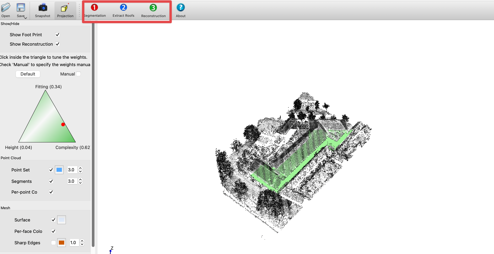

## City3D: Large-scale Building Reconstruction from Airborne LiDAR Point Clouds

City3D implements the hypothesis-and-selection based building reconstruction method described in the following [paper](https://www.mdpi.com/2072-4292/14/9/2254):
```
Jin Huang, Jantien Stoter, Ravi Peters, Liangliang Nan. 
City3D: Large-scale Building Reconstruction from Airborne LiDAR Point Clouds.
Remote Sensing. 14(9), 2254, 2022.
```

This implementation is based on [PolyFit](https://github.com/LiangliangNan/PolyFit).

---

### Obtaining City3D

You can build City3D from the source code˙

* Download the [source code](https://github.com/tudelft3d/City3D).
* Dependencies
    - [Qt](https://www.qt.io/) (v5.12 and later). This is required for only the [GUI demo](./City3D) of City3D. Without Qt, you should still be able to build the [commandline example](./Example) of City3D.
    - [CGAL](http://www.cgal.org/index.html) (v5.0 and later).
    - [OpenCv](https://opencv.org/releases/) (v4.0 and later, only the main modules are needed).
    - [Gurobi](https://www.gurobi.com/) (optional but recommended).

* Build
    - There are many ways to build City3D. Choose one of the following (or whatever you are familiar with):
        - Option 1: Use any IDE that can directly handle CMakeLists files to open the CMakeLists.txt in the root directory of City3D. Then you should have obtained a usable project and just build. I recommend using [CLion](https://www.jetbrains.com/clion/).
        - Option 2: Use CMake to generate project files for your IDE. Then load the project to your IDE and build.
        - Option 3: Use CMake to generate Makefiles and then `make` (on Linux/macOS) or `nmake`(on Windows with Microsoft Visual Studio). For Windows users,  you can also install Linux on Windows with  [WSL](https://docs.microsoft.com/en-us/windows/wsl/install). For Linux or macOS, you can simply
            ```
            $ cd City3D
            $ mkdir Release
            $ cd Release
            $ cmake -DCMAKE_BUILD_TYPE=Release ..
            $ make
            ```
---

### Run City3D
For the [commandline example](./Example), you can simply build and run it (the paths to the input files are hard-coded in the [code](./Example/main.cpp)).

The demo version adapts the UI of [PolyFit](https://github.com/LiangliangNan/PolyFit), which provides a simple user interface with a few buttons (with numbered icons). Just click the buttons one by one in the specified order.

---

<p align="center"> 
      
</p>

### Data
Some test data can be downloaded from the [data](https://github.com/tudelft3d/City3D/tree/main/data) directory.

---

### About the solvers
This demo program can use either the open-source SCIP solver or the commercial solver Gurobi. The entire source code 
of the SCIP solver is already included in this repository.

The Gurobi solver is faster than SCIP and is thus highly recommended. To use Gurobi, install it first and make sure 
the headers and libraries of Gurobi can be found by CMake. This can be done by specifying the paths of Gurobi in [FindGUROBI.cmake](https://github.com/tudelft3d/City3D/blob/main/cmake/FindGUROBI.cmake). 
Note: you need to [obtain a license](https://www.gurobi.com/downloads/end-user-license-agreement-academic/) to use Gurobi, which is free for academic use.

---

### Citation
If you use the code/program (or part) of City3D in a scientific work, please cite our paper:

```bibtex
@Article{HuangCity3d_2022,
    AUTHOR = {Huang, Jin and Stoter, Jantien and Peters, Ravi and Nan, Liangliang},
    TITLE = {City3D: Large-Scale Building Reconstruction from Airborne LiDAR Point Clouds},
    JOURNAL = {Remote Sensing},
    VOLUME = {14},
    YEAR = {2022},
    NUMBER = {9},
    ARTICLE-NUMBER = {2254},
}

```

## TODOs
This is an academic prototype of LoD2 building reconstruction from LiDAR point clouds. Many intermediate steps can be improved.
- [ ] Integrate with other line segments detector, like [LSD](http://www.ipol.im/pub/art/2012/gjmr-lsd/?utm%20source=doi)
- [ ] Use more robust plane segmentation methods, like [PDPC](https://github.com/STORM-IRIT/Plane-Detection-Point-Cloud)
- [ ] Compare our cluster based shape regularization scheme with the one in [CGAL](https://doc.cgal.org/latest/Shape_regularization/index.html)
                           

---

### License
This program is free software; you can redistribute it and/or modify it under the terms of the GNU General Public License as published by the Free Software Foundation; either version 3 of the License or (at your option) any later version. The full text of the license can be found in the accompanying LICENSE file.

---

Should you have any questions, comments, or suggestions, please feel free to contact me at:
J.Huang-1@tudelft.nl 

**_Jin Huang_**

https://yidahuang.github.io/

June 28, 2022

Copyright (C) 2022 

